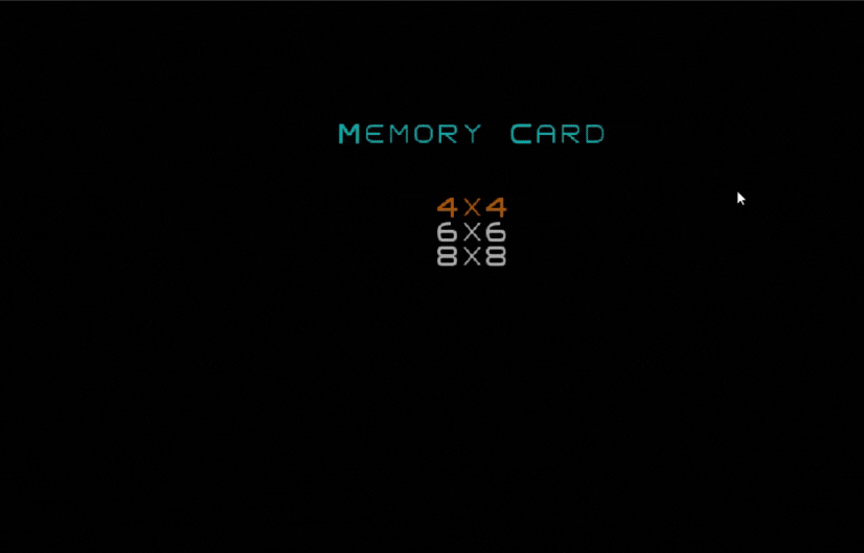

# Features

- Implemented a classic Memory Card Game where players flip pairs of cards to find matches;
- Designed multiple grid sizes (4×4, 6×6, and 8×8) to provide different difficulty levels;
- Added an error counter that tracks mismatched attempts and influences the final score;
- Included a timer to measure how long players take to complete each game;
- Implemented a main menu system allowing players to select grid size and start new games;
- Ensured smooth state transitions between hidden, revealed, and matched cards using a clear state management design;
- Applied object-oriented principles and design patterns such as State, Command, and Strategy for flexibility and maintainability;
- Implemented dynamic grid rendering that adapts to the selected board size and terminal layout.

# Screenshots

### Main menu

### Game screen

### End screen

### 4x4 Example

  

# Authors

- Pedro Henrique Pessôa Camargo (up202102365)
- Raí Ribeiro Évora (up202309532)
