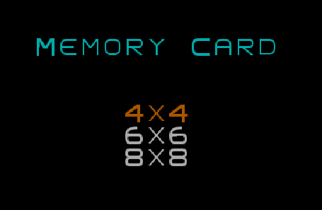
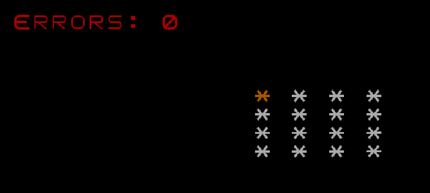
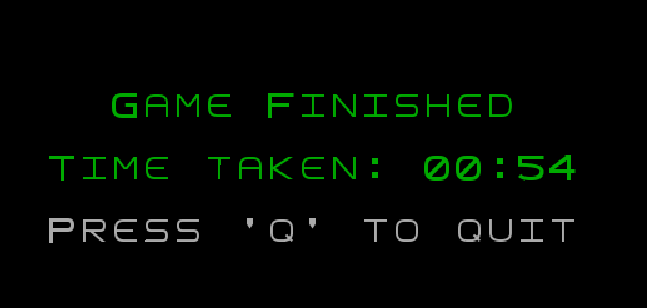
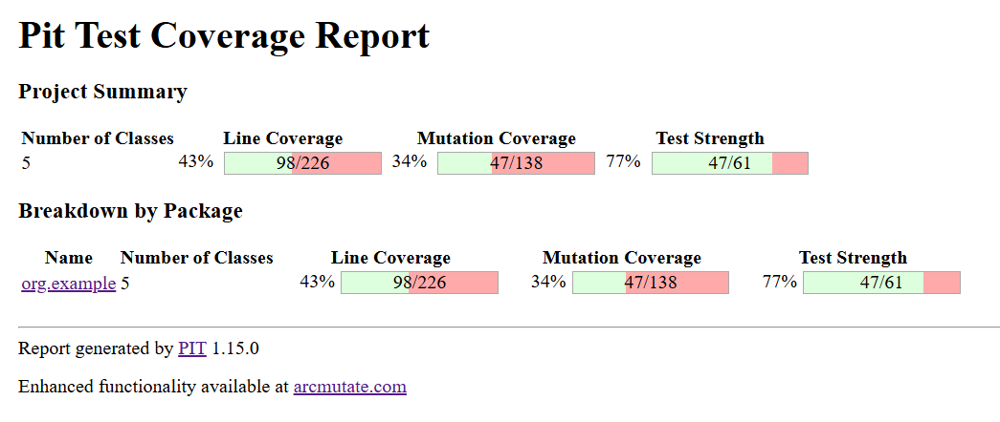
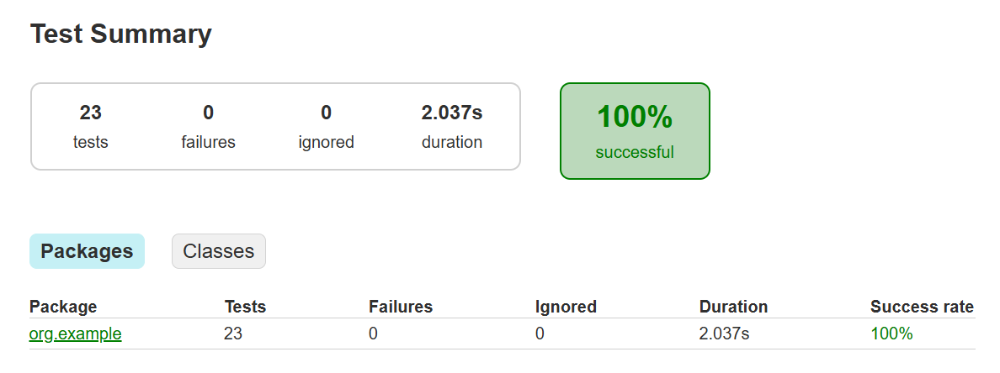

## LDTS_T15_G03 - MEMORY CARD

## Game Description

The Memory Card Game we’re implementing is a classic matching game where players test their memory by revealing pairs of cards from a face-down grid. The goal is to match all pairs in as few turns as possible. Each time two selected cards don’t match, they flip back down, challenging players to remember their positions for future attempts. The game rewards concentration, making it both engaging and competitive.

This project was developed by Pedro Camargo (up202102365@fe.up.pt) and Raí Évora (up202309532@fe.up.pt) for LDTS.

### IMPLEMENTED FEATURES

- **Error Counter** - we count the mismatches, with fewer points resulting in a higher score;
- **Different Grid Sizes** - for varying difficulty levels (4x4, 6x6, and 8x8);
- **Timer** - the user can keep track of the time needed to complete a level.

### Main menu

### Game screen

### End screen

### DESIGN

#### Managing the State of Cards

**Problem in Context**

In the game, each card has multiple states: hidden, revealed, or matched. Ensuring consistent transitions between these states (e.g., preventing a revealed card from being hidden again while it’s matched) is critical to maintaining game logic. Without a clear structure, the state transitions could become error-prone and difficult to maintain.

**The Pattern**

The State pattern is ideal because it encapsulates the card's state logic into separate classes. Instead of managing state transitions directly in the Card class, each state is represented by a distinct object, and transitions are delegated to these objects. This avoids complex conditional logic and keeps the Card class clean.

**Implementation**

The card states (hidden, revealed, and matched) are managed directly within the Card class using boolean flags. Each card has two attributes, isRevealed and isMatched, which track its current state. Initially, every card is hidden (isRevealed = false) and unmatched (isMatched = false).
The reveal() method changes the card's state to revealed by setting isRevealed to true. Similarly, the hide() method resets the state to hidden by setting isRevealed to false. When two cards match, the setMatched() method is called to mark them as matched, setting isMatched to true. The matches() method compares the card's value with another card to determine if they match, encapsulating the matching logic within the card itself.

**Consequences**

The use of the State Pattern in the current design allows the following benefits:

- Simplifies the Card class by delegating state logic to separate classes;
- Makes adding or modifying states easier;
- Ensures consistency in state transitions.

#### Selecting the Grid Size in the Menu

**Problem in Context**

The main menu allows players to choose a grid size (4x4, 6x6, or 8x8). The challenge lies in handling user input, navigation, and starting the game with the selected grid size while maintaining separation of concerns between menu logic and game logic.

**The Pattern**

The Command pattern is suitable for encapsulating menu actions as commands. Each menu option can be represented as a command object, decoupling the menu input logic from the actions performed when an option is selected.

**Implementation**

The menu is implemented as part of the Game class, where three options for grid sizes (4x4, 6x6, and 8x8) are displayed. The menu tracks the currently selected option using an integer variable selectedOption. This variable is updated based on user input, allowing the player to navigate through the menu using the arrow keys. When the Enter key is pressed, the game starts with the grid size corresponding to the selected option.
The menu display dynamically highlights the currently selected option using color changes. The game determines the grid size by mapping the selectedOption to a predefined value: 0 corresponds to a 4x4 grid, 1 to a 6x6 grid, and 2 to an 8x8 grid. Once the player makes a selection, a new grid is initialized with the chosen size, and the game loop begins.

**Consequences**

The use of the Command Pattern in the current design allows the following benefits:

- Decouples menu navigation from the actions performed;
- Simplifies adding new menu options;
- Encourages reuse of command logic in different contexts.

#### Rendering the Grid Dynamically

**Problem in Context**

The grid needs to adapt to different sizes (4x4, 6x6, or 8x8) and be rendered dynamically on the terminal. Managing the layout and ensuring proper alignment for various sizes could become heavy.

**The Pattern**

The Strategy pattern allows encapsulating different layout strategies for rendering the grid. This makes it easy to switch rendering logic based on grid size or terminal configuration.

**Implementation**

The grid rendering logic is designed to adapt to different grid sizes (4x4, 6x6, or 8x8) and terminal dimensions. The Grid class calculates the appropriate offsets to center the grid within the terminal window. This ensures that the grid remains visually appealing and properly aligned regardless of the terminal's size. The rendering process involves iterating over the grid and drawing each card at its respective position.

**Consequences**

The use of the Strategy Pattern in the current design allows the following benefits:

- Makes the grid rendering logic flexible and extensible;
- Simplifies testing and debugging different rendering strategies;
- Encourages reuse of rendering logic in other parts of the application.

#### KNOWN CODE SMELLS

We have fixed all the errors reported by error-prone. No other major code smells identified.

### TESTING

- [Mutation tests](../build/reports/pitest/index.html)

- [Tests coverage](../build/reports/tests/index.html)

### SELF-EVALUATION 

- Pedro Camargo: 50%
- Raí Évora: 50%